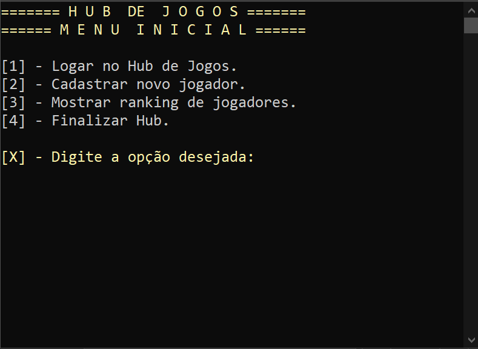
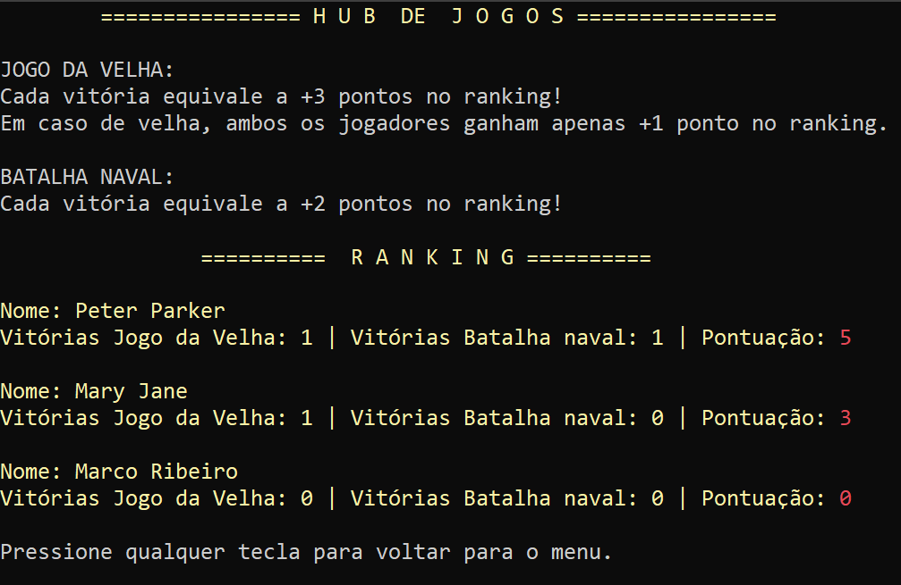
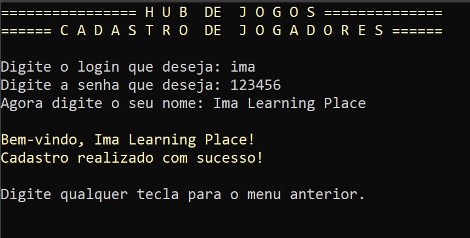
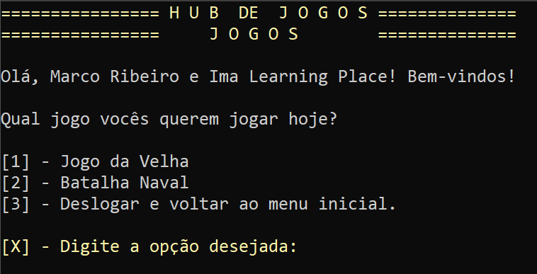
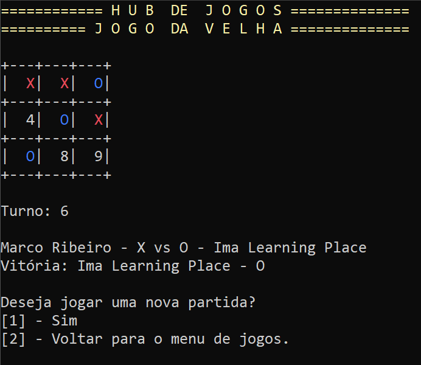
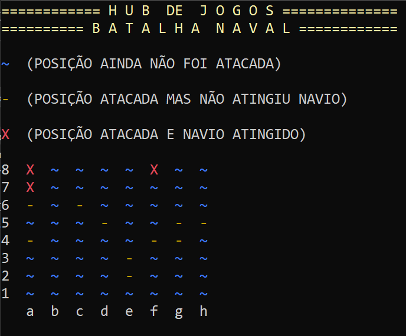

<h1 align="center" id ="sobre">Hub de Jogos - SharpCoders &#9813:magnet: 
 </h1>
Hub desenvolvido desenvolvido para o programa de formação SharpCoders.

Nesse programa você poderá escolher entre jogar jogo da velha e uma releitura do jogo batalha naval batalha naval. 

<h4 align="center"> 
	🚧  HUB DE JOGOS 🚀 Concluído...  🚧
</h4>

 <a href="#sobre">Sobre</a> •
 <a href="#demonstracao">Demonstração</a> • 
 <a href="#features">Features</a> • 
 <a href="#tecnologias">Tecnologias</a> • 
 <a href="#autor">Autor</a>

<h2 align="center" id="demonstracao"> Demonstração </h2>

  
  
  
  
  
  

<h1 align="center" id="features">Features :hammer_and_wrench:</h1>

Quando abrir a aplicação você terá o menu inicial. 

Nesse menu você poderá escolher entre 3 opções: 

<ol>
  <li>[x] Logar no HUB de jogos.</li>
    <dd> - É necessário ter duas contas criadas para conseguir acessar o HUB. </dd>
    <dd> - Após o login, vocês serão redirecionados para o menu de jogos. </dd>
  <li>[x] Cadastrar novas contas.</li>
    <dd> - Você cadastra um login, uma senha e usa o seu nome para ser identificado. </dd>
    <dd> - Você volta ao menu inicial após o cadastro. </dd>
  <li>[x] Ver o ranking de jogadores cadastrados.</li>
    <dd> - Mostra o nome de todos os usuários cadastrados, o número de vitórias da batalha naval, número de vitórias do jogo da velha e a pontuação geral. </dd>
    <dd> - Os usuários são organizado de acordo com a pontuação final. Da mais alta para a mais baixa. </dd>
    <dd> - OBS: Todos os usuários são armazenados em um arquivo .json para serem mantidos no programa. </dd>
</ol>

Após logar, você terá o menu de jogos. Lá você poderá escolher entre. 

<ol>
  <li>[x] Jogar o jogo da velha.</li>
    <dd> - Jogo simples, com as mesmas regras. </dd>
  <li>[x] Jogar a batalha naval.</li>
    <dd> - É uma releitura do clássico jogo batalha naval, as instruções estão dentro do jogo. </dd>
  <li>[x] Deslogar do HUB e voltar para o menu inicial.</li>
</ol>

<h1 align="center" id="tecnologias">
  Tecnologias :desktop_computer:
 </h1>
 

         
         
      

 
    A aplicação feita para console, utilizando C# e a IDE VSCommunity. Foi feita com POO (Programação orientada a objetos). Todos os dados dos jogadores e ranking persistem em arquivo .JSON

### Créditos: 
<a href="https://www.flaticon.com/br/icones-gratis/json" title="json ícones">Json ícones criados por Smashicons - Flaticon</a>

## Autor
Feito com carinho e dedicação!

